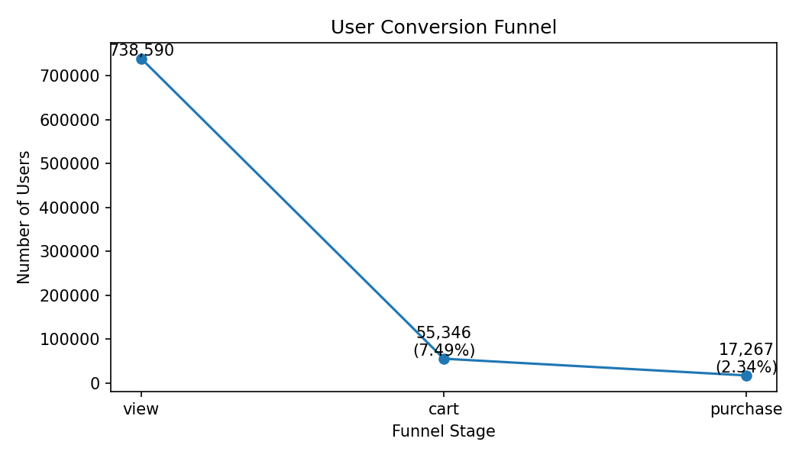
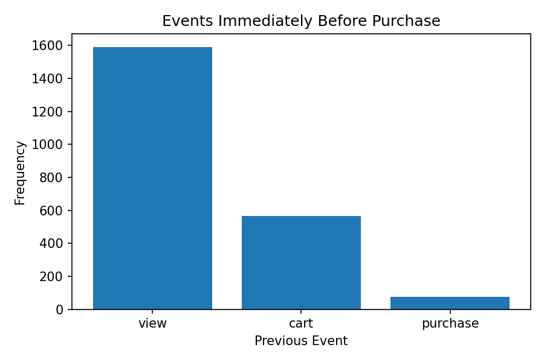
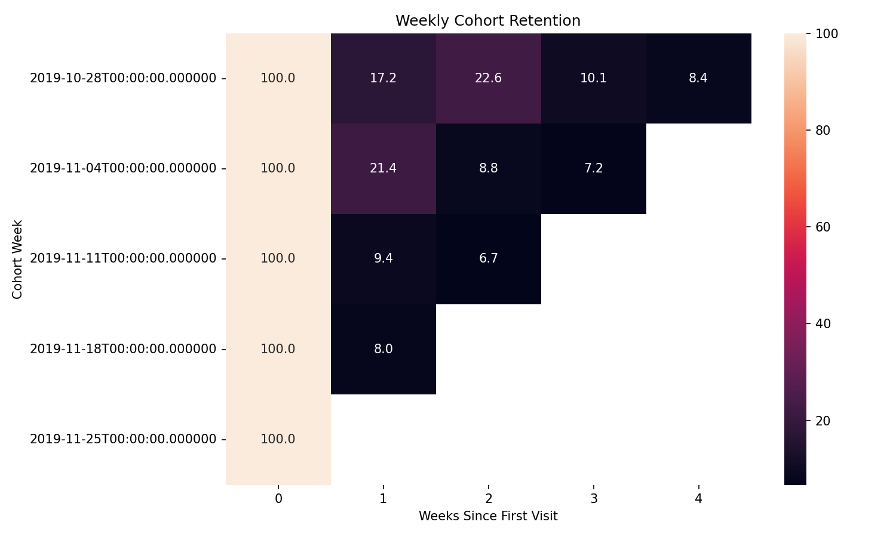

> SQL 기반으로 사용자 행동을 분석하고, 전환 구조와 리텐션 문제를 데이터로 설명한 프로젝트입니다.

# E-commerce Product Analytics  
### Funnel, User Journey, and Cohort Retention (SQL-Based)

---

##  Project Overview

This project analyzes user behavior in an e-commerce platform using event log data.

The analysis focuses on:
- Funnel conversion (view → cart → purchase)
- Pre-purchase behavior patterns
- Weekly cohort retention

The goal is to identify drop-off points and understand how user behavior leads to conversion.

---

##  Dataset
> Dataset sourced from Kaggle and processed for scalable SQL-based analysis.

- Source: E-commerce event log data (Kaggle)
- Link: https://www.kaggle.com/datasets/mkechinov/ecommerce-behavior-data-from-multi-category-store
- Events: `view`, `cart`, `purchase`
- Data size: ~67M rows (sampled for analysis)

⚠️ Note  
This analysis is based on a sampled dataset generated using chunk-based random sampling due to the large size of the raw data.

---

##  Data Preparation

- Filtered relevant event types
- Processed timestamp fields
- Created structured dataset for SQL-based analysis

---

##  Funnel Analysis

### Insight

There is a significant drop-off between **view and cart (~7.5%)**, indicating weak purchase intent or friction before adding items to cart.  

However, once users reach the cart stage, conversion to purchase is relatively high (~31%), suggesting strong intent among engaged users.

---

##  Pre-purchase Behavior Analysis

### Insight

Most purchases are preceded by **product views (~71%)**, followed by cart interactions (~25%).  

This suggests that many users convert after a short interaction flow or repeated product views, highlighting the importance of product page experience.

---

##  Weekly Cohort Retention

### Insight

Retention drops sharply after week 1 across all cohorts, with most cohorts falling below 20%.  

This indicates that early-stage engagement is weak and user churn occurs quickly after initial interaction.

---

##  Business Implications

- Improve **view → cart conversion**
- Optimize **product page experience**
- Strengthen **early user engagement and retention**

---

##  Tech Stack

- SQL (DuckDB)
- Python (Pandas, Matplotlib, Seaborn)
- Google Colab

---

##  Project Structure
ecommerce-product-analytics/  
│  
├── ecommerce_user_behavior_analysis.ipynb  
├── sql/  
│ ├── funnel_analysis.sql  
│ ├── pre_purchase_analysis.sql  
│ └── cohort_retention.sql  
│  
├── outputs/  
│ ├── funnel_chart.png  
│ ├── journey_chart.png  
│ └── cohort_heatmap.png  
│  
└── README.md  

---

##  Key Takeaways

- Identified conversion bottlenecks in user funnel
- Analyzed behavioral patterns leading to purchase
- Measured retention trends across cohorts
- Demonstrated SQL-based product analytics workflow
